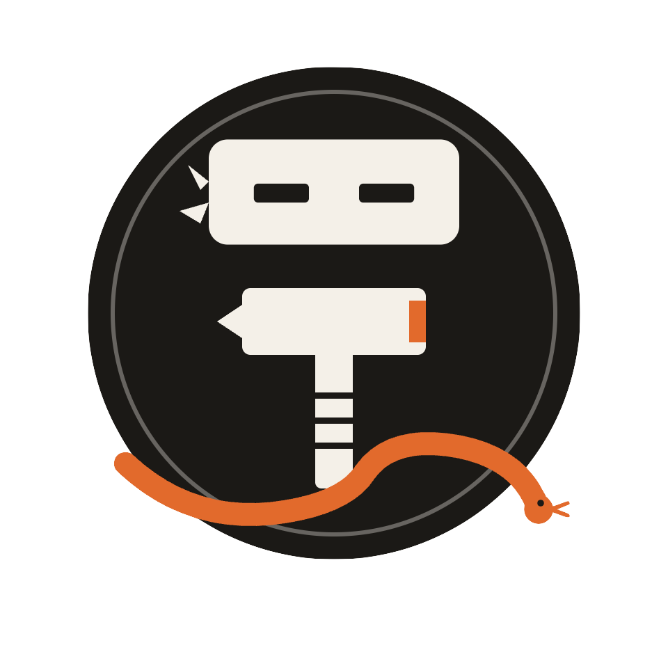

<h1 align="center">
    
    <br />
    Bob the Builder
    <br />
    
    
    
</h1>

<h4 align="center">
    The ergonomic Ninja-based build system.
</h4>

<p align="center">
    🏃 <a href="#getting-started">Getting Started</a>
    &nbsp;&middot&nbsp;
    ⌨️ <a href="#cli">CLI</a>
    &nbsp;&middot&nbsp;
    🎯 <a href="#goals">Goals</a>
    &nbsp;&middot&nbsp;
    🙏 <a href="#acknowledgements">Acknowledgements</a>
</p>

## Getting Started

```bash
uv tool install git+https://github.com/bob-hq/bob --with git+https://github.com/bob-hq/bob-std 
```

## CLI


## Goals

Sorted by priority:

- **Writing Bobfiles, writing plugins and rules, and composing Bobfiles** should all be easy and feel Pythonic.
- **Type safety** should allow for a smooth editing experience and easy-to-debug errors.
- **Plugins should be close to the actual commands** rather than lock you in to a specific paradigm.
- **Speed** should be fast.

## Acknowledgements

- [Bake](https://github.com/nmraz/bake/)
- [Kbuild](https://docs.kernel.org/kbuild/)
- [Ninja's configure.py](https://github.com/ninja-build/ninja/blob/master/configure.py)
- Thanks to everyone who helped design Bob, in particular Noam Raz.
